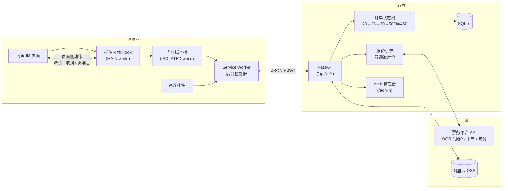
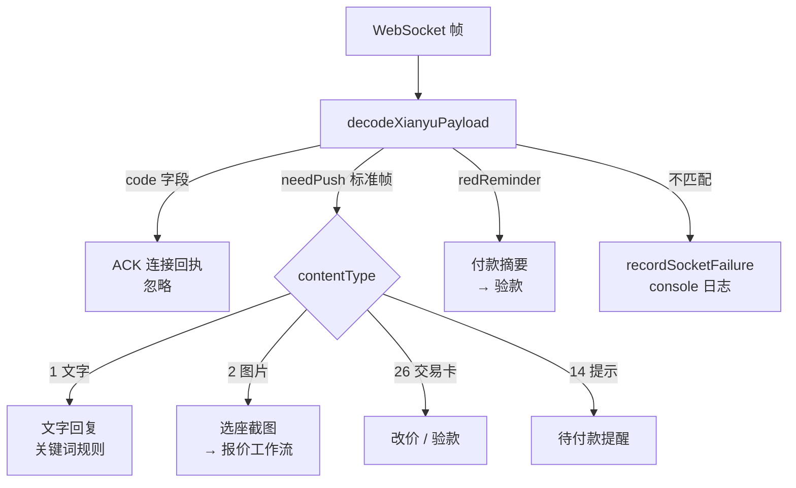
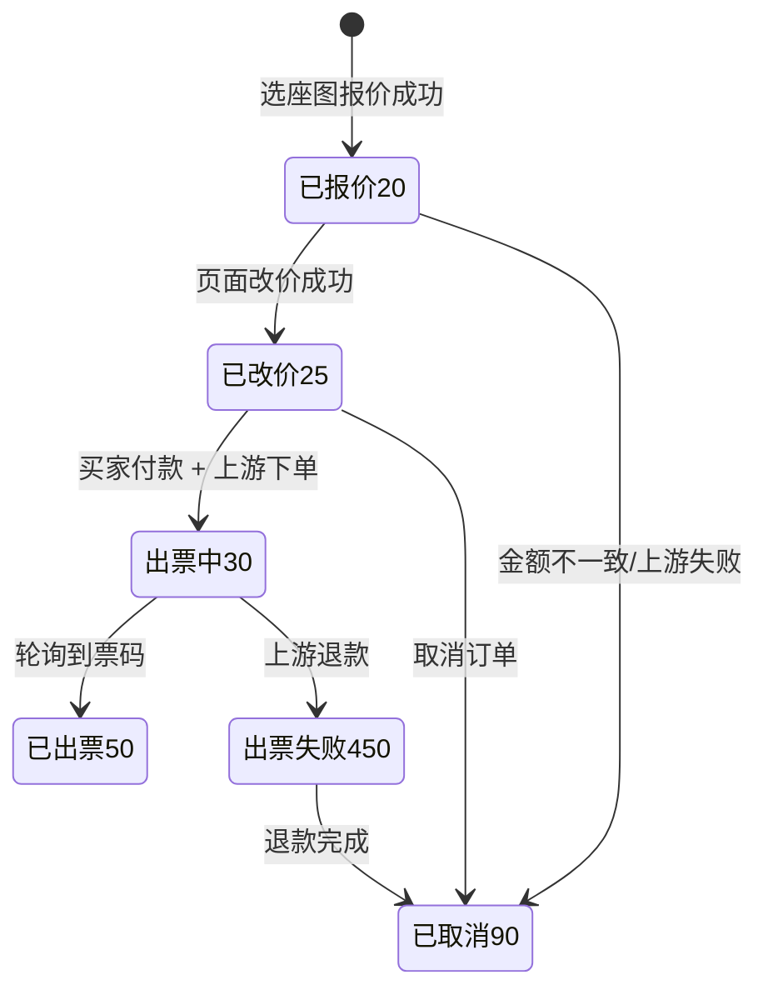
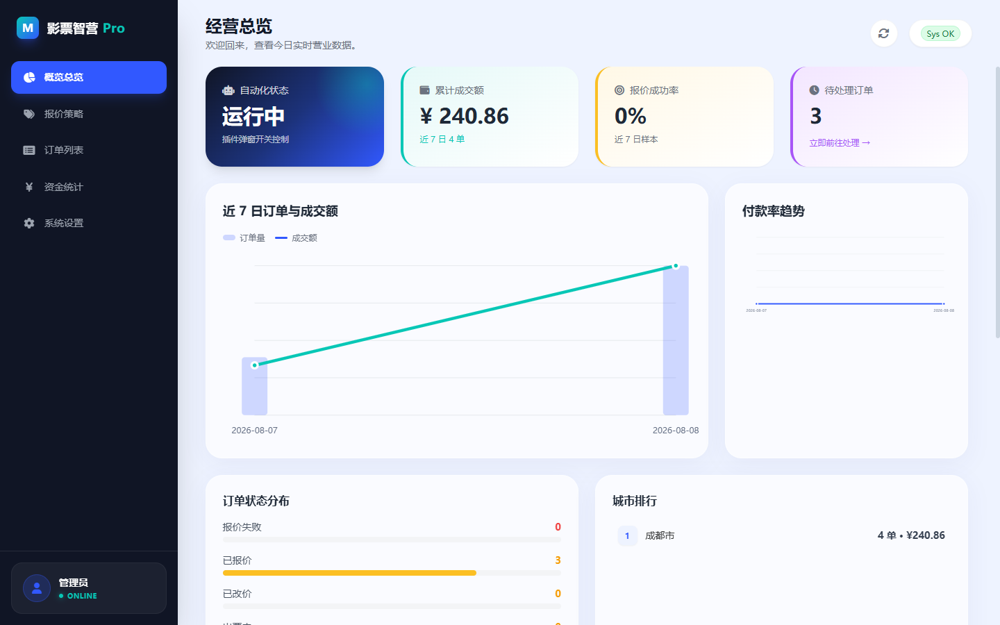
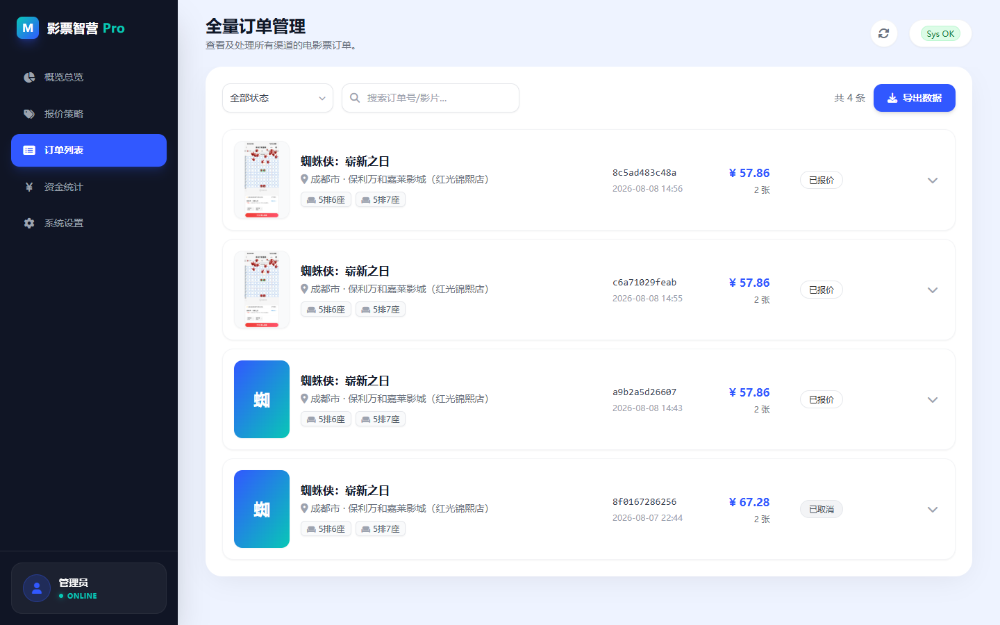
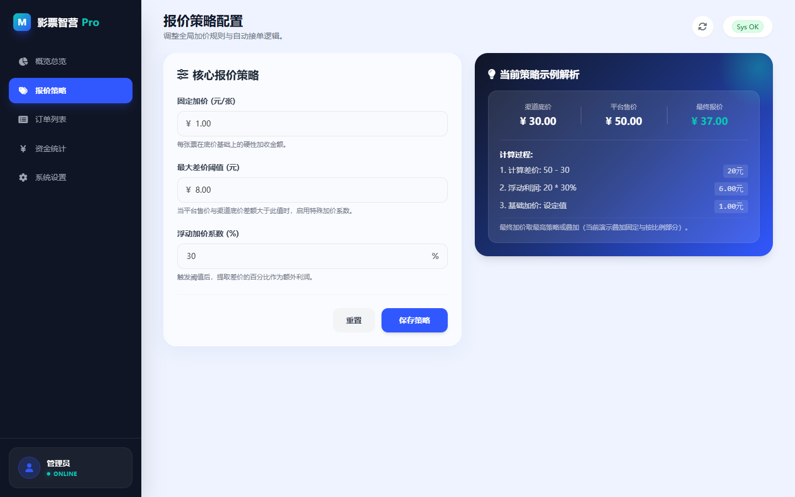
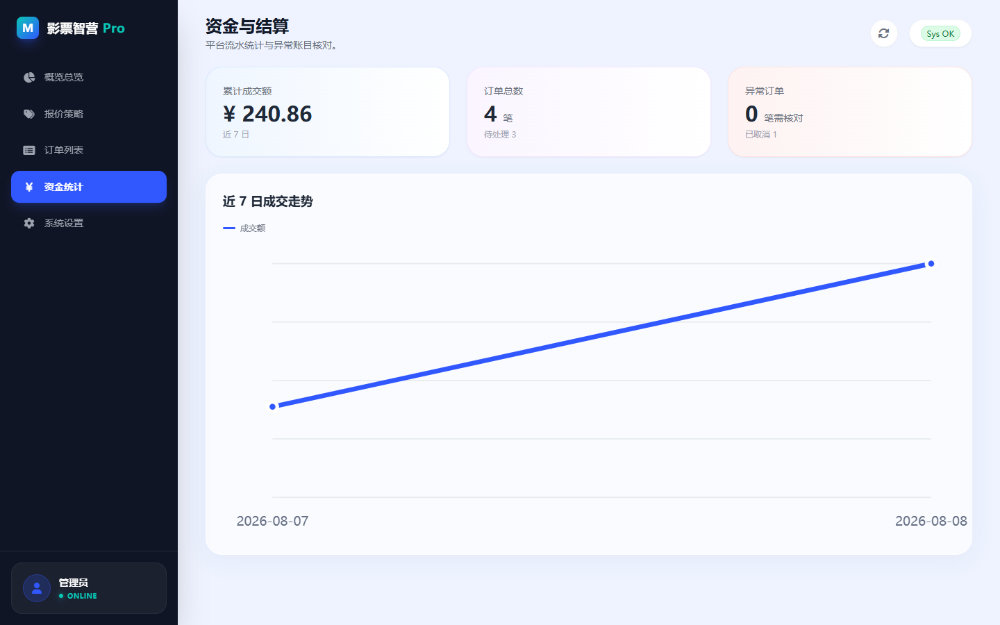
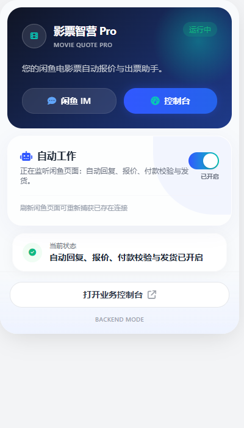
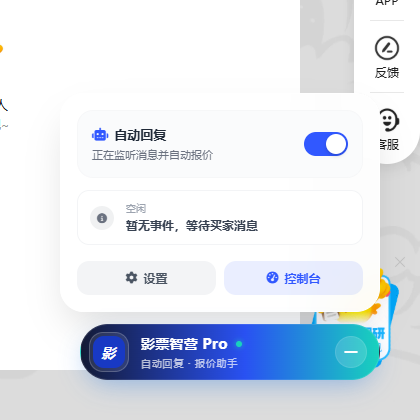

<div align="center">

# 🎬 影票智营 Pro

**闲鱼电影票 · 自动报价 / 改价 / 出票 / 发货一体化平台**

浏览器插件 · FastAPI 后端 · Web 管理台


插件测试 **244 通过** · 后端测试 **14 通过** · CI 5/5 ✓

</div>

---

买家在闲鱼发来一张选座截图，系统自动完成：**识别影片场次 → 双通道官方报价 → 定价话术 → 付款校验 → 上游下单 → 取票码交付**，全程无人值守。

## 📖 目录

- [架构](#-架构)
- [功能](#-功能)
- [核心流程](#-核心流程)
- [技术亮点](#-技术亮点)
- [截图](#-截图)
- [快速开始](#-快速开始)
- [项目结构](#-项目结构)
- [开发](#-开发)

---

## 🏗 架构



**分层职责**

| 层 | 技术 | 职责 |
|---|---|---|
| 页面 Hook | `MAIN world` 注入 | 拦截 WebSocket、msgpack 解码、事件识别 |
| 内容脚本 | `ISOLATED world` | 安全桥接（白名单校验）、挂件注入 |
| 后台控制器 | Service Worker | 业务编排、后端代理、状态收尾 |
| 业务后端 | FastAPI | 订单状态机、上游对接、报价策略、话术下发 |
| 管理台 | 原生 JS + SVG 图表 | 经营看板、订单管理、报价配置 |

---

## ✨ 功能

| 能力 | 说明 |
|---|---|
| ⚡ **自动报价** | 选座截图 → OCR 识别 → 限价/一口价双通道 → 取较高正价 + 加价策略 → 话术报价 |
| 💱 **改价催付** | 买家拍下金额不一致 → 页面侧 MTop 自动改价 → 催付话术 |
| 🔍 **付款校验** | 校验实际付款金额：一致则上游下单支付；不一致自动取消退款 |
| 🎫 **自动出票** | 10s 轮询出票状态 → 取票码/票图交付 → 失败自动通知退款 |
| 💬 **话术管理** | 插件控制台编辑模板与关键词规则，写回后端即时生效 |
| 🧲 **悬浮挂件** | 闲鱼页右下角胶囊：状态呼吸灯、开关、最近事件 |
| 📊 **运营看板** | 订单趋势、报价成功率、状态分布、城市排行、资金走势 |
| 📱 **移动端适配** | 管理台响应式：抽屉导航、卡片列表、可缩放图表 |

---

## 🔄 核心流程

### 1. 消息解码（webhook 层）



### 2. 报价链路

```text
买家选座截图
  → IMAGE_MESSAGE 事件
  → 发送「正在识别」话术
  → POST /quote-image（插件 → 后端）
      ├─ 下载图片（带 Referer 防防盗链）
      ├─ 上传阿里云 OSS（生成公网 URL）
      ├─ 上游 OCR：识别 showId / 影片 / 场次 / 座位 / 价格
      ├─ 双通道官方报价：
      │    ├─ LIMIT_PRICE 限价通道
      │    └─ FIX_PRICE   一口价通道
      │    └─ 取较高正价（0 价视为通道失败，瞬态错误自动重试）
      ├─ 报价策略：固定加价 + 差价阈值系数
      └─ 派生订单 status=20（含座位图快照）
  → 报价成功 / 失败话术
```

### 3. 订单状态机



---

## 🛠 技术亮点

| 技术点 | 实现 |
|---|---|
| **WebSocket 协议逆向** | 拦截 `wss://wss-goofish.dingtalk.com`，msgpack-lite 解码，`/reg → ACK`、`/s/sync`、`/s/vulcan` 推送、15s 心跳全链路解析 |
| **双世界注入** | `MAIN world` 装 WebSocket 钩子（先于页面建连），`ISOLATED world` 做消息白名单桥接，`decodeToolRequest` 拒绝未授权动作 |
| **双通道报价策略** | 限价 + 一口价双通道取较高正价；**0 价 = 通道失败**（杜绝亏本报价）；瞬态错误自动重试 2 次 |
| **订单状态机** | SQLite 持久化，状态迁移带操作审计（`updated_at`、`failure_reason`、结算 journal 防重放） |
| **安全结算** | 金额不一致/上游失败自动取消 + 话术通知；`settlementJournal` 保证写操作幂等，SW 重启可恢复 |
| **JWT 认证** | HS256 + 7 天 TTL，`/api/v1/plugin/*` 全部 Bearer 保护 |
| **图片代理** | 闲鱼 alicdn 防盗链 → 后端带 Referer 代理抓取（URL 白名单防 SSRF） |
| **内存安全** | 消息去重滑动窗口、日志全量脱敏（token/票码/图片绝不入日志）、调试状态 DOM 属性化 |
| **移动端** | 管理台抽屉导航 + 响应式卡片 + SVG 图表（零 CDN、CSP 安全） |

---

## 📸 截图

### Web 管理台

| 经营总览 | 订单列表 |
|:---:|:---:|
|  |  |
| **报价策略** | **资金统计** |
|  |  |

### 插件端

| 插件弹窗 | 闲鱼悬浮挂件 |
|:---:|:---:|
|  |  |

---

## 🚀 快速开始

### 1. 启动后端

```bash
cd extension
python -m venv backend/.venv
backend/.venv/Scripts/python -m pip install -r backend/requirements.txt

# Windows 一键启动（含环境变量示例）
backend/run.bat
```

必需环境变量：

| 变量 | 说明 |
|---|---|
| `APP_AUTH_JWT_SECRET` | JWT 签名密钥（生产必改） |
| `LIANGPIAO_USER_NAME` / `LIANGPIAO_PASSWORD` | 上游票务账号（报价/出票需要） |
| `OSS_ACCESS_KEY_ID` / `OSS_ACCESS_KEY_SECRET` | 阿里云 OSS 凭证 |
| `OSS_BUCKET` / `OSS_REGION` | OSS 桶与区域 |

> ⚠️ **安全**：代码不内置任何真实凭证，全部走环境变量。

### 2. 安装插件

```bash
cd extension
npm install
npm run build
```

Chrome → `chrome://extensions` → 开发者模式 → 加载已解压扩展 → 选择 `extension/dist`

### 3. 登录配置

1. 浏览器打开 `http://127.0.0.1:8000/admin/`（admin/admin123）
2. 插件弹窗 → 业务控制台 → 后端地址 `http://127.0.0.1:8000` → 登录
3. 控制台调整话术/关键词 → 弹窗开启「自动工作」

---

## 📁 项目结构

```
extension/
├── src/                        # 插件源码 (TypeScript)
│   ├── webhook/                # 页面 Hook / 协议解码 / 悬浮挂件 / 发消息
│   │   ├── xianyuPageHook.ts   # WebSocket 拦截 + 事件分发
│   │   ├── xianyuProtocol.ts   # 帧解码器（ACK/sync/vulcan/交易卡）
│   │   ├── xianyuWidget.ts     # 悬浮挂件（胶囊 + 面板）
│   │   └── xianyuMtopExecutor.ts  # 页面侧 MTop 动作
│   ├── handlers/               # 业务控制器
│   │   ├── automationLifecycle.ts       # 自动化状态机（登录/同步/安全关闭）
│   │   ├── paidVerificationAutomation.ts # 付款校验 → 出票推进
│   │   ├── ticketDeliveryAutomation.ts  # 票码交付
│   │   └── backendApiClient.ts          # 后端客户端（JWT）
│   └── ui/                     # popup 与控制台
├── backend/                    # FastAPI 后端
│   ├── main.py                 # 全部 API 路由
│   ├── quote.py                # 双通道报价引擎
│   ├── orders.py               # 订单状态机
│   ├── liangpiao_client.py     # 上游客户端（OCR/报价/下单）
│   ├── web/                    # Web 管理台
│   └── data/                   # SQLite（运行时生成）
├── test/                       # 244 个测试用例
└── docs/                       # 截图 / 业务开发地图
```

---

## 🧪 开发

| 命令 | 说明 |
|---|---|
| `npm test` | 插件测试（244 用例） |
| `npm run typecheck` | TypeScript 类型检查 |
| `npm run build` | 构建插件 |
| `backend/.venv/Scripts/python -m unittest backend.test_backend` | 后端测试 |
| `backend/run.bat` | 启动后端 |

**开发地图**：`extension/docs/业务开发地图.md` — 消息链路、状态机、常见改动点。

---

<div align="center">

*影票智营 Pro · Movie Quote Pro — 让闲鱼电影票生意自动化*
</div>
